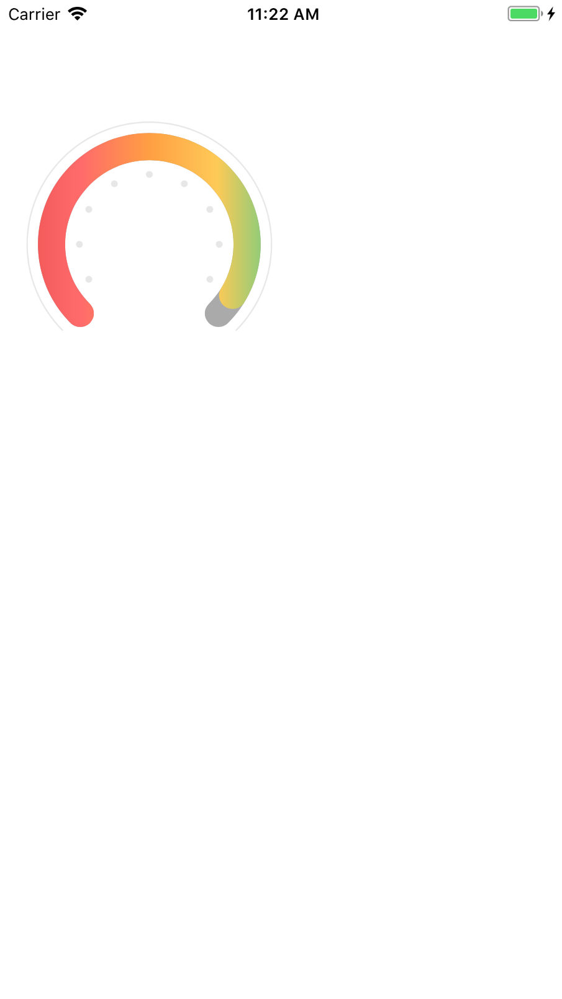

# ZJSGradientProgressRing
The Gradient Progress Ring




```
self.demo2View = [[ZJSGradientProgressRing alloc] init];
self.demo2View.gradientLayer.colors = @[(__bridge id)ColorWithRGBHEX(0xee5353).CGColor, (__bridge id)ColorWithRGBHEX(0xff6b6b).CGColor, (__bridge id)ColorWithRGBHEX(0xff9f43).CGColor, (__bridge id)ColorWithRGBHEX(0xfeca57).CGColor, (__bridge id)ColorWithRGBHEX(0x58cd8a).CGColor];
self.demo2View.gradientLayer.locations = @[@0, @0.25, @0.5, @0.75, @1.0];
self.demo2View.lineWidth = 20;
self.demo2View.minAngle = M_PI_2 + M_PI_4;
self.demo2View.maxAngle = M_PI * 2 + M_PI_4;
self.demo2View.progress = 0.1;
self.demo2View.animationDuration = 0.5;
self.demo2View.frame = CGRectMake(10, 80 , 200, 200);
[self.view addSubview:self.demo2View];
```